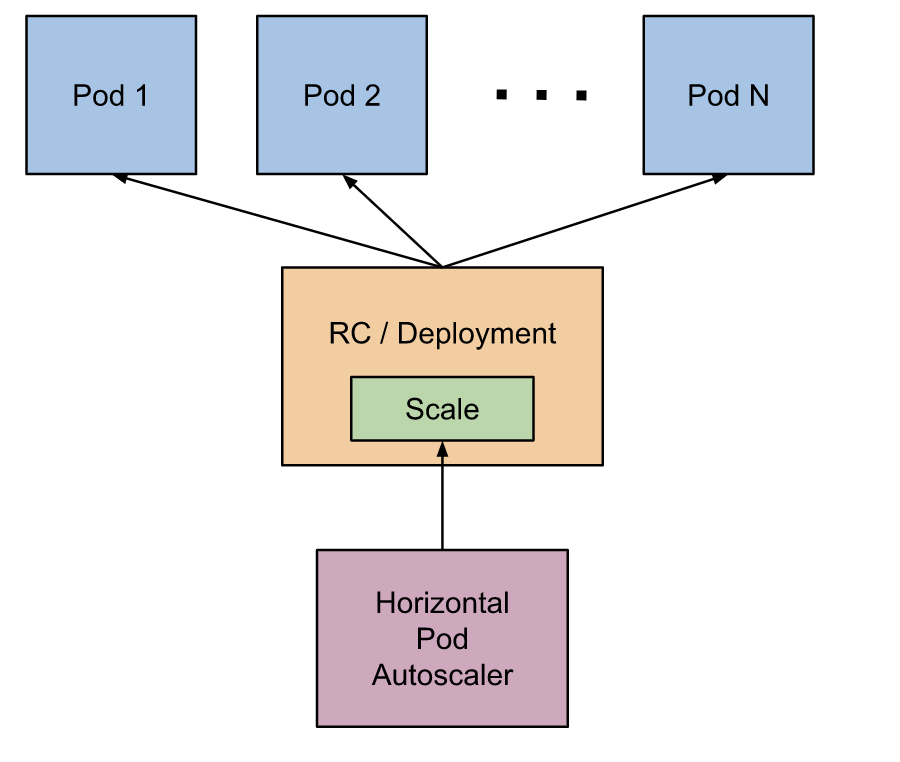
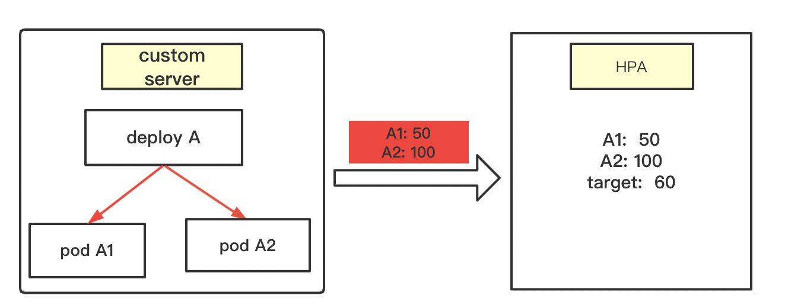
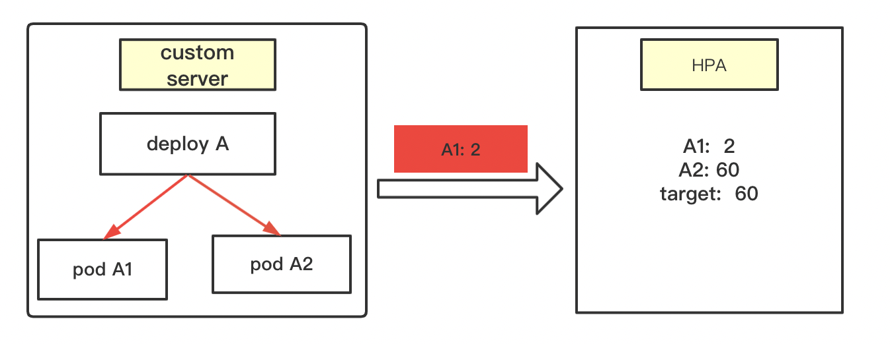

[TOC]

**本章重点：** 从源码角度分析hpa的计算逻辑

### 1. hpa介绍

#### 1.1 hpa是什么

hpa指的是 Pod 水平自动扩缩，全名是Horizontal Pod Autoscaler简称HPA。它可以基于 CPU 利用率或其他指标自动扩缩 ReplicationController、Deployment 和 ReplicaSet 中的 Pod 数量。

**用处：**  用户可以通过设置hpa，实现deploy pod数量的自动扩缩容。比如流量大的时候，pod数量多一些。流量小的时候，Pod数量降下来，避免资源浪费。



<br>

####  1.2 hpa如何用起来

（1）需要一个deploy/svc等，可以参考社区

（2）需要对应的hpa

举例：

(1) 创建1个deploy。这里只有1个副本

```
apiVersion: apps/v1
kind: Deployment
metadata:
  labels:
    app: zx-hpa-test
  name: zx-hpa
spec:
  strategy:
    type: RollingUpdate
    rollingUpdate:
      maxSurge: 1
  replicas: 2
  selector:
    matchLabels:
      app: zx-hpa-test
  template:
    metadata:
      labels:
        app: zx-hpa-test
      name: zx-hpa-test
    spec:
      terminationGracePeriodSeconds: 5
      containers:
        - name: busybox
          image: busybox:latest
          imagePullPolicy: IfNotPresent
          command:
            - sleep
            - "3600"
```

（2）创建对应的hpa。

```
apiVersion: autoscaling/v2beta1
kind: HorizontalPodAutoscaler
metadata:
  name: nginx-hpa-zx-1
  annotations:
    metric-containerName: zx-hpa
spec:
  scaleTargetRef:
    apiVersion: apps/v1   // 这里必须指定需要监控那个对象
    kind: Deployment
    name: zx-hpa
  minReplicas: 1          // deploy最小的Pod数量
  maxReplicas: 3          // deploy最大的Pod数量
  metrics:
    - type: Pods
      pods:
        metricName: pod_cpu_1m
        targetAverageValue: 60
```

hpa是从同命名空间下，找对应的deploy。所以yaml中指定deploy的时候不要指定namespaces。这也就要求，hpa 和deploy必须在同一命名空间。

<br>

这里我使用的 pod_cpu_1m这个指标。这是一个自定义指标。接下来就是分析

创建好之后，观察hpa，当deploy的cpu利用率变化时，deploy的副本会随之改变。

<br>

###  2. hpa 源码分析

#### 2.1 启动参数介绍

hpa controller随controller manager的初始化而启动，hpa controller将以下flag添加到controller manager的flag中，通过controller manager的CLI端暴露给用户：

```
// AddFlags adds flags related to HPAController for controller manager to the specified FlagSet.
func (o *HPAControllerOptions) AddFlags(fs *pflag.FlagSet) {
	if o == nil {
		return
	}

	fs.DurationVar(&o.HorizontalPodAutoscalerSyncPeriod.Duration, "horizontal-pod-autoscaler-sync-period", o.HorizontalPodAutoscalerSyncPeriod.Duration, "The period for syncing the number of pods in horizontal pod autoscaler.")
	fs.DurationVar(&o.HorizontalPodAutoscalerUpscaleForbiddenWindow.Duration, "horizontal-pod-autoscaler-upscale-delay", o.HorizontalPodAutoscalerUpscaleForbiddenWindow.Duration, "The period since last upscale, before another upscale can be performed in horizontal pod autoscaler.")
	fs.MarkDeprecated("horizontal-pod-autoscaler-upscale-delay", "This flag is currently no-op and will be deleted.")
	fs.DurationVar(&o.HorizontalPodAutoscalerDownscaleStabilizationWindow.Duration, "horizontal-pod-autoscaler-downscale-stabilization", o.HorizontalPodAutoscalerDownscaleStabilizationWindow.Duration, "The period for which autoscaler will look backwards and not scale down below any recommendation it made during that period.")
	fs.DurationVar(&o.HorizontalPodAutoscalerDownscaleForbiddenWindow.Duration, "horizontal-pod-autoscaler-downscale-delay", o.HorizontalPodAutoscalerDownscaleForbiddenWindow.Duration, "The period since last downscale, before another downscale can be performed in horizontal pod autoscaler.")
	fs.MarkDeprecated("horizontal-pod-autoscaler-downscale-delay", "This flag is currently no-op and will be deleted.")
	fs.Float64Var(&o.HorizontalPodAutoscalerTolerance, "horizontal-pod-autoscaler-tolerance", o.HorizontalPodAutoscalerTolerance, "The minimum change (from 1.0) in the desired-to-actual metrics ratio for the horizontal pod autoscaler to consider scaling.")
	fs.BoolVar(&o.HorizontalPodAutoscalerUseRESTClients, "horizontal-pod-autoscaler-use-rest-clients", o.HorizontalPodAutoscalerUseRESTClients, "If set to true, causes the horizontal pod autoscaler controller to use REST clients through the kube-aggregator, instead of using the legacy metrics client through the API server proxy.  This is required for custom metrics support in the horizontal pod autoscaler.")
	fs.DurationVar(&o.HorizontalPodAutoscalerCPUInitializationPeriod.Duration, "horizontal-pod-autoscaler-cpu-initialization-period", o.HorizontalPodAutoscalerCPUInitializationPeriod.Duration, "The period after pod start when CPU samples might be skipped.")
	fs.MarkDeprecated("horizontal-pod-autoscaler-use-rest-clients", "Heapster is no longer supported as a source for Horizontal Pod Autoscaler metrics.")
	fs.DurationVar(&o.HorizontalPodAutoscalerInitialReadinessDelay.Duration, "horizontal-pod-autoscaler-initial-readiness-delay", o.HorizontalPodAutoscalerInitialReadinessDelay.Duration, "The period after pod start during which readiness changes will be treated as initial readiness.")
}
```

| 参数                                                | 默认 | 说明                                                         |
| :-------------------------------------------------- | :--- | :----------------------------------------------------------- |
| horizontal-pod-autoscaler-sync-period               | 15s  | controller同步HPA信息的同步周期                              |
| horizontal-pod-autoscaler-downscale-stabilization   | 5m   | 缩容稳定窗口，缩容间隔时间（v1.12支持）                      |
| horizontal-pod-autoscaler-tolerance                 | 0.1  | 最小缩放容忍度：计算出的期望值和实际值的比率<最小容忍比率，则不进行扩缩容 |
| horizontal-pod-autoscaler-cpu-initialization-period | 5m   | pod刚启动时，一定时间内的CPU使用率数据不参与计算。           |
| horizontal-pod-autoscaler-initial-readiness-delay   | 30s  | 扩容等待pod ready的时间（无法得知pod何时就绪）               |

kcm中需要设置这个，才能启动自定义的rest-clients。   --horizontal-pod-autoscaler-use-rest-clients=true

<br>

#### 2.2 启动流程

**代码流程： **

startHPAControllerWithMetricsClient -> startHPAControllerWithMetricsClient -> Run -> worker -> processNextWorkItem -> reconcileKey->reconcileAutoscaler

```
func (a *HorizontalController) reconcileKey(key string) (deleted bool, err error) {
	namespace, name, err := cache.SplitMetaNamespaceKey(key)
	if err != nil {
		return true, err
	}

	hpa, err := a.hpaLister.HorizontalPodAutoscalers(namespace).Get(name)
	if errors.IsNotFound(err) {
		klog.Infof("Horizontal Pod Autoscaler %s has been deleted in %s", name, namespace)
		delete(a.recommendations, key)
		return true, nil
	}

	return false, a.reconcileAutoscaler(hpa, key)
}
```

<br>

####  2.3 核心计算逻辑

**metric的定义类型分为3种，resource、pods和external，这里只分析pods类型的metric。**

reconcileAutoscaler函数就是hpa的核心函数。该函数主要逻辑如下：

* 1.做一些类型转换，用于接下来的Hpa计算
* 2.计算hpa 的期望副本数量。
* 3.根据计算的结果判断是否需要改变副本数，需要改变的话，调用接口修改，然后做错误处理。

```go
func (a *HorizontalController) reconcileAutoscaler(hpav1Shared *autoscalingv1.HorizontalPodAutoscaler, key string) error {
	// 1. 调用client向apiserver发送请求，scale是返回的hpa实体,然后做各种数据类型转换，然后通过一个client向apiserver获取scale，以及当然还有一些backup、把错误写入hpa event的操作
   。。。。代码省略

  // 2. 判断是否需要计算副本数，如果需要，就调用computeReplicasForMetrics函数计算当前hpa的副本数。
	desiredReplicas := int32(0)
	rescaleReason := ""

	var minReplicas int32

	if hpa.Spec.MinReplicas != nil {
		minReplicas = *hpa.Spec.MinReplicas
	} else {
		// Default value
		minReplicas = 1
	}

	rescale := true

	if scale.Spec.Replicas == 0 && minReplicas != 0 {
		// Autoscaling is disabled for this resource
		desiredReplicas = 0
		rescale = false
		setCondition(hpa, autoscalingv2.ScalingActive, v1.ConditionFalse, "ScalingDisabled", "scaling is disabled since the replica count of the target is zero")
	} else if currentReplicas > hpa.Spec.MaxReplicas {
		rescaleReason = "Current number of replicas above Spec.MaxReplicas"
		desiredReplicas = hpa.Spec.MaxReplicas
	} else if currentReplicas < minReplicas {
		rescaleReason = "Current number of replicas below Spec.MinReplicas"
		desiredReplicas = minReplicas
	} else {
		var metricTimestamp time.Time
		metricDesiredReplicas, metricName, metricStatuses, metricTimestamp, err = a.computeReplicasForMetrics(hpa, scale, hpa.Spec.Metrics)
		if err != nil {
			a.setCurrentReplicasInStatus(hpa, currentReplicas)
			if err := a.updateStatusIfNeeded(hpaStatusOriginal, hpa); err != nil {
				utilruntime.HandleError(err)
			}
			a.eventRecorder.Event(hpa, v1.EventTypeWarning, "FailedComputeMetricsReplicas", err.Error())
			return fmt.Errorf("failed to compute desired number of replicas based on listed metrics for %s: %v", reference, err)
		}

		klog.V(4).Infof("proposing %v desired replicas (based on %s from %s) for %s", metricDesiredReplicas, metricName, metricTimestamp, reference)

		rescaleMetric := ""
		if metricDesiredReplicas > desiredReplicas {
			desiredReplicas = metricDesiredReplicas
			rescaleMetric = metricName
		}
		if desiredReplicas > currentReplicas {
			rescaleReason = fmt.Sprintf("%s above target", rescaleMetric)
		}
		if desiredReplicas < currentReplicas {
			rescaleReason = "All metrics below target"
		}
		desiredReplicas = a.normalizeDesiredReplicas(hpa, key, currentReplicas, desiredReplicas, minReplicas)
		rescale = desiredReplicas != currentReplicas
	}
  
  // 3.进行扩缩容，并进行错误处理。
	if rescale {
		scale.Spec.Replicas = desiredReplicas
		_, err = a.scaleNamespacer.Scales(hpa.Namespace).Update(targetGR, scale)
		if err != nil {
			a.eventRecorder.Eventf(hpa, v1.EventTypeWarning, "FailedRescale", "New size: %d; reason: %s; error: %v", desiredReplicas, rescaleReason, err.Error())
			setCondition(hpa, autoscalingv2.AbleToScale, v1.ConditionFalse, "FailedUpdateScale", "the HPA controller was unable to update the target scale: %v", err)
			a.setCurrentReplicasInStatus(hpa, currentReplicas)
			if err := a.updateStatusIfNeeded(hpaStatusOriginal, hpa); err != nil {
				utilruntime.HandleError(err)
			}
			return fmt.Errorf("failed to rescale %s: %v", reference, err)
		}
		setCondition(hpa, autoscalingv2.AbleToScale, v1.ConditionTrue, "SucceededRescale", "the HPA controller was able to update the target scale to %d", desiredReplicas)
		a.eventRecorder.Eventf(hpa, v1.EventTypeNormal, "SuccessfulRescale", "New size: %d; reason: %s", desiredReplicas, rescaleReason)
		klog.Infof("Successful rescale of %s, old size: %d, new size: %d, reason: %s",
			hpa.Name, currentReplicas, desiredReplicas, rescaleReason)
	} else {
		klog.V(4).Infof("decided not to scale %s to %v (last scale time was %s)", reference, desiredReplicas, hpa.Status.LastScaleTime)
		desiredReplicas = currentReplicas
	}

	a.setStatus(hpa, currentReplicas, desiredReplicas, metricStatuses, rescale)
	return a.updateStatusIfNeeded(hpaStatusOriginal, hpa)
}
```

<br>

**这里主要关心第二个步骤：hpa如何计算期望副本数量**

#### 2.4  计算期望副本数量

概念：

最小值：minReplicas。 这个是用户在hpa里面的yaml设置的。这个是可选的，如果不设置，默认是1。

最大值：MaxReplicas。 这个是用户在hpa里面的yaml设置的。这个必填的，如果不设置，会报错, 如下。

当前值：currentReplicas。这个是hpa获得的当前deploy的副本数量。

期望值：desiredReplicas。 这个是hpa希望deploy的副本数量。

```
error: error validating "nginx-deployment-hpa-test.yaml": error validating data: ValidationError(HorizontalPodAutoscaler.spec): missing required field "maxReplicas" in io.k8s.api.autoscaling.v2beta1.HorizontalPodAutoscalerSpec; if you choose to ignore these errors, turn validation off with --validate=false
```

计算逻辑分为两部分，第一种情况是不需要算，就可以直接得出期望值。 第二种情况需要调用函数计算。

**情况1：不需要计算**

（1）当前值等于0。        期望值=0.    不扩容，

（2）当前值 > 最大值。    没必要计算期望值。 期望值=最大值，需要扩缩容。

（3）当前值 < 最小值。   没必要计算期望值。 期望值=最小值，需要扩缩容。

<br>

**情况2：**    最小值  <= 当前值  <= 最大值。 需要调用函数计算 期望值。

这里的调用链为  computeReplicasForMetrics -> computeReplicasForMetric -> GetMetricReplicas  

这里computeReplicasForMetrics有一个需要注意的点就是。这里可以处理了多个metric的情况。例如：这里一个hpa有多个指标。

```text
 - type: Resource
    resource:
      name: cpu
      # Utilization类型的目标值，Resource类型的指标只支持Utilization和AverageValue类型的目标值
      target:
        type: Utilization
        averageUtilization: 50
  # Pods类型的指标
  - type: Pods
    pods:
      metric:
        name: packets-per-second
      # AverageValue类型的目标值，Pods指标类型下只支持AverageValue类型的目标值
      target:
        type: AverageValue
        averageValue: 1k
```

这里hpa的逻辑是，谁最大取谁。例如, 通过cpu.Utilization hpa算出来应该需要 4个pod。 但是packets-per-second算出来需要5个。这个时候就已5个为准。见下面代码：

```
// computeReplicasForMetrics computes the desired number of replicas for the metric specifications listed in the HPA,
// returning the maximum  of the computed replica counts, a description of the associated metric, and the statuses of
// all metrics computed.
func (a *HorizontalController) computeReplicasForMetrics(hpa *autoscalingv2.HorizontalPodAutoscaler, scale *autoscalingv1.Scale,
	metricSpecs []autoscalingv2.MetricSpec) (replicas int32, metric string, statuses []autoscalingv2.MetricStatus, timestamp time.Time, err error) {

	for i, metricSpec := range metricSpecs {
		replicaCountProposal, metricNameProposal, timestampProposal, condition, err := a.computeReplicasForMetric(hpa, metricSpec, specReplicas, statusReplicas, selector, &statuses[i])

		if err != nil {
			if invalidMetricsCount <= 0 {
				invalidMetricCondition = condition
				invalidMetricError = err
			}
			invalidMetricsCount++
		}
		if err == nil && (replicas == 0 || replicaCountProposal > replicas) {
			timestamp = timestampProposal
			replicas = replicaCountProposal
			metric = metricNameProposal
		}
	}

	// If all metrics are invalid return error and set condition on hpa based on first invalid metric.
	if invalidMetricsCount >= len(metricSpecs) {
		setCondition(hpa, invalidMetricCondition.Type, invalidMetricCondition.Status, invalidMetricCondition.Reason, invalidMetricCondition.Message)
		return 0, "", statuses, time.Time{}, fmt.Errorf("invalid metrics (%v invalid out of %v), first error is: %v", invalidMetricsCount, len(metricSpecs), invalidMetricError)
	}
	setCondition(hpa, autoscalingv2.ScalingActive, v1.ConditionTrue, "ValidMetricFound", "the HPA was able to successfully calculate a replica count from %s", metric)
	return replicas, metric, statuses, timestamp, nil
}
```

<br>

针对具体某个metric指标。计算分为俩步：

（1）GetRawMetric函数： 得到 具体的metric值

（2）calcPlainMetricReplicas ：计算期望副本值

这里需要注意一点就是targetUtilization进行了数据转换。乘以了10^3。

```
// GetMetricReplicas calculates the desired replica count based on a target metric utilization
// (as a milli-value) for pods matching the given selector in the given namespace, and the
// current replica count
func (c *ReplicaCalculator) GetMetricReplicas(currentReplicas int32, targetUtilization int64, metricName string, namespace string, selector labels.Selector, metricSelector labels.Selector) (replicaCount int32, utilization int64, timestamp time.Time, err error) {
	metrics, timestamp, err := c.metricsClient.GetRawMetric(metricName, namespace, selector, metricSelector)
	if err != nil {
		return 0, 0, time.Time{}, fmt.Errorf("unable to get metric %s: %v", metricName, err)
	}

	replicaCount, utilization, err = c.calcPlainMetricReplicas(metrics, currentReplicas, targetUtilization, namespace, selector, v1.ResourceName(""))
	return replicaCount, utilization, timestamp, err
}
```

<br>

##### 2.4.1 GetRawMetric-具体的metric值

```
// GetRawMetric gets the given metric (and an associated oldest timestamp)
// for all pods matching the specified selector in the given namespace
func (c *customMetricsClient) GetRawMetric(metricName string, namespace string, selector labels.Selector, metricSelector labels.Selector) (PodMetricsInfo, time.Time, error) {
  // 1.这里直接调用 GetForObjects，发送restful请求获取数据
	metrics, err := c.client.NamespacedMetrics(namespace).GetForObjects(schema.GroupKind{Kind: "Pod"}, selector, metricName, metricSelector)
	if err != nil {
		return nil, time.Time{}, fmt.Errorf("unable to fetch metrics from custom metrics API: %v", err)
	}

	if len(metrics.Items) == 0 {
		return nil, time.Time{}, fmt.Errorf("no metrics returned from custom metrics API")
	}
  
  // 2. 对获取的数据进行处理。这里看起来是乘以了 10^3
	res := make(PodMetricsInfo, len(metrics.Items))
	for _, m := range metrics.Items {
		window := metricServerDefaultMetricWindow
		if m.WindowSeconds != nil {
			window = time.Duration(*m.WindowSeconds) * time.Second
		}
		res[m.DescribedObject.Name] = PodMetric{
			Timestamp: m.Timestamp.Time,
			Window:    window,
			Value:     int64(m.Value.MilliValue()),
		}

		m.Value.MilliValue()
	}

	timestamp := metrics.Items[0].Timestamp.Time

	return res, timestamp, nil
}
```

<br>

##### 2.4.2 calcPlainMetricReplicas-计算期望副本值

这里代码省略，直接贴逻辑。

3.1 先从apiserver端拿到所有相关的pod，将这些pod分为三类：

 ```
a.missingPods用于记录处于running状态，但不提供该metric的pod

b.ignoredPods 用于处理resource类型cpu相关metric的延迟（就是pod未就绪），这里不深入讨论

c.readyPodCount记录状态为running，且能提供该metric的pod
 ```

3.2 调用GetMetricUtilizationRatio计算实际值与期望值的对比情况。计算时，对于所有可获取到metric的pod，取它们metric value的平均值得到：usageRatio=实际值/期望值；utilization=实际值（平均）

3.3 计算期望pod数量DesiredReplicas。对于missingPods为0，即所有target pod都处于running可获取metric value的情况:

 a.如果实际值与期望值的对比usageRatio处于可容忍范围内，不执行scale操作。默认情况下c.tolerance=0.1，即usageRatio处于

[0.9,1.1]时pod数量不变化

```
if math.Abs(1.0-usageRatio) <= c.tolerance {
    // return the current replicas if the change would be too small
    return currentReplicas, utilization, nil
}
```

b.实际值与期望值的对比usageRatio不在可容忍范围内，向上取整得到desiredReplicas
 `return int32(math.Ceil(usageRatio * float64(readyPodCount))), utilization, nil`

对于missingPods>0，即有target pod的metric value没有获取到的情况。 缩容时，对于找不到metric的pod，`视为`正好用了desired value

```
if usageRatio < 1.0 {
// on a scale-down, treat missing pods as using 100% of the resource request
for podName := range missingPods {
	metrics[podName] = metricsclient.PodMetric{Value: targetUtilization}
        }
} 
```

扩容时，对于找不到metric的pod，`视为`该pod对指定metric的使用量为0

```
for podName := range missingPods {
	metrics[podName] = metricsclient.PodMetric{Value: 0}
}
```

经过上面的处理后，重新计算实际值与期望值的对比newUsageRatio。

 在下面两种情况下，不执行scale操作：新的实际值与期望值的对比newUsageRatio在容忍范围内； 赋值处理前后，一个需要scale up，另一个需要scale down。

其它情况下，同样地执行向上取整操作

```
if math.Abs(1.0-newUsageRatio) <= c.tolerance || (usageRatio < 1.0 && newUsageRatio > 1.0) || (usageRatio > 1.0 && newUsageRatio < 1.0) {
		// return the current replicas if the change would be too small,
		// or if the new usage ratio would cause a change in scale direction
		return currentReplicas, utilization, nil
	}
return int32(math.Ceil(newUsageRatio * float64(len(metrics)))), utilization, nil
```

<br>

最后，Hpa将desiredReplicas写到scale.Spec.Replicas，调用a.scaleNamespacer.Scales(hpa.Namespace).Update(targetGR, scale)向apiserver发送更新hpa的请求，对某个hpa的一轮更新操作就完成了。

<br>

### 3. 举例说明计算过程

#### 3.1 hpa扩容计算逻辑

**关键概念**：tolerance（hpa扩容容忍度）， 默认为0.1。

Custom server: 自定义metric服务。这里是一个抽象，用于给hpa提供具体的metric值。Custom server具体可以是prometheus，或者其他的监控系统。下一篇文章会讲如何将Custom server和hpa联系起来。

 <br>

#### 3.2 场景1

当前有deployA,  运行着俩个pod, A1和A2。 deploy设置了hpa，指标是内存使用量，并且规定，当平均使用量大于60就要扩容。



hpa扩容计算步骤：

**第一步:**  往monitor-adaptor发送请求， 要求获得deployA下所有pod的metric值。  这里收到了 A1=50; A2=100

**第二步:**  补全metric值，给获取不到metric值的pod赋值。  这里hpa会查看集群状态，发现deployA 下有俩个pod，A1,A2。并且这两个pod的metric值都获取到了。  这个时候就不用补全。（下面例子就介绍需要补全metric的情况）

**第三步:**  开始计算

（1）计算 平均pod metric值和 target的比例。也可以叫扩容比例系数

      ratio = (A1+A2)/(2*target) = (50+100)/120 = 1.25

   按理说不用再除target值，直接（50+100)/2=75，然后拿75和60比就行。 75比60大就应该扩容。

这里使用系数表示主要有俩个原因：

* 有容忍度的概念，使用比例方便和计算是否超出了容忍度
* 用于扩缩容计算

（2）判断是否超过容忍度

这里 1.25-1 > 0.1(默认容忍度)。 因此这种情况是需要扩容的。

这里就体现了容忍度的作用。有了容忍度, 平均metric需要大于 66才会扩容（60*1.1）

（3）计算真正的副本数量

   向上取整： 扩容比例系数*当前的副本数

这里就是： 1.25*2 = 2.5 , 取整后就是3。

<br>

#### 3.3 场景2

和场景1不同在于：由于某件原因，导致 monitor-adaptor往hpa发送的时候，只有  A1=20。 A2的数据丢失。


hpa扩容计算步骤：

**第一步:**  往monitor-adaptor发送请求， 要求获得deployA下所有pod的metric值。  这里收到了 A1=2;

**第二步:**  补全metric值，给获取不到metric值的pod赋值。  这里hpa会查看集群状态，发现deployA 下有俩个pod，A1,A2。但是这里发现只有A1的值，这个时候hpa就认为A2 有数据，但是获取失败。所以就会给A2自己赋值， 0/target。

赋值逻辑如下：  当 A1 > target的时候，A2=0;  当A1<= target的时候，赋值为 target。

这里由于 A1=2, 比target(60)小，所以最终hpa计算时:

A1=2; A2=60; target=60;  

**第三步:**  开始计算

（1）计算 平均pod metric值和 target的比例。也可以叫扩容比例系数

      ratio = (A1+A2)/(2*target) = (2+60)/120 = 0.517

（2）判断是否超过容忍度

这里 1-0.517 > 0.1(默认容忍度)。 因此这种情况是需要缩容的。

（3）计算真正的副本数量

向上取整： 扩容比例系数*当前的副本数（这里就是metric数量，A1,A2）

对应就是： 0.517*2 = 1.034 , 取整后就是2。

<br>

### 4. 总结

（1）hpa可以设置多个metric。当有多个metric时，谁算出来的副本值最大，取谁的值

（2）针对具体的metric而言（这里是以pods这种为例），首先获得用户定义的hpa指标。比如最大值，最小值，阈值等。

这里有一个点在于。阈值乘以了1000用于计算。

（3）获取metric的值，这里是使用了自定义rest服务。hpa只要发送rest请求，就有数据。这种情况非常适用于公司使用自己的监控数据做扩缩容。 注意：这里每个值也乘以了1000。这样和阈值就是相互抵消了。

（4）利用公式计算期望值。  期望值*X <= 当前pod所有的metric值。X取小的正整数。具体逻辑可以看上文的计算过程。

